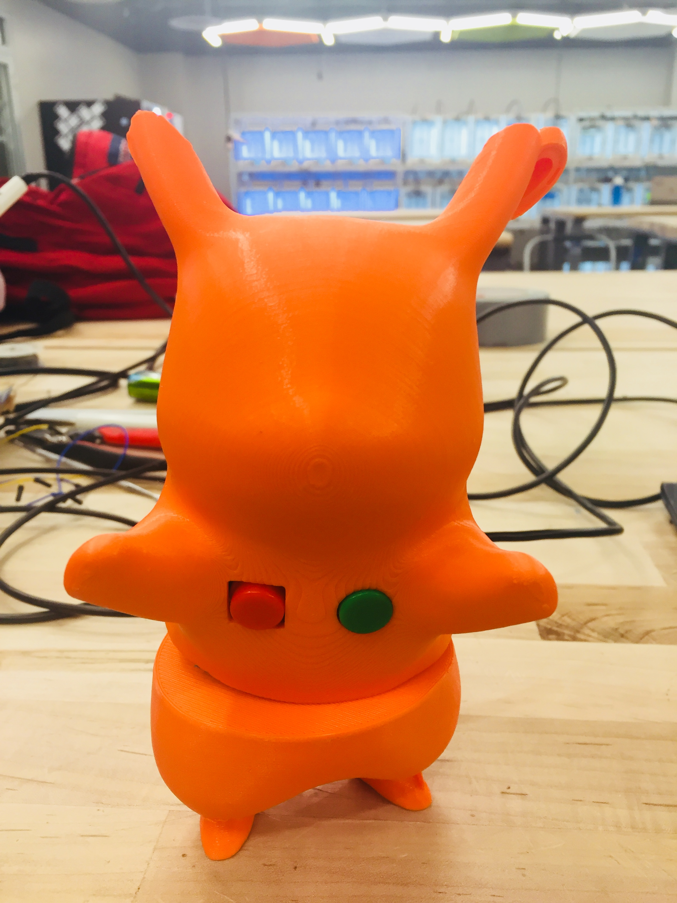
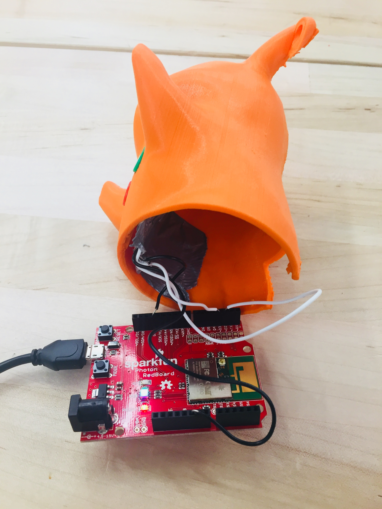
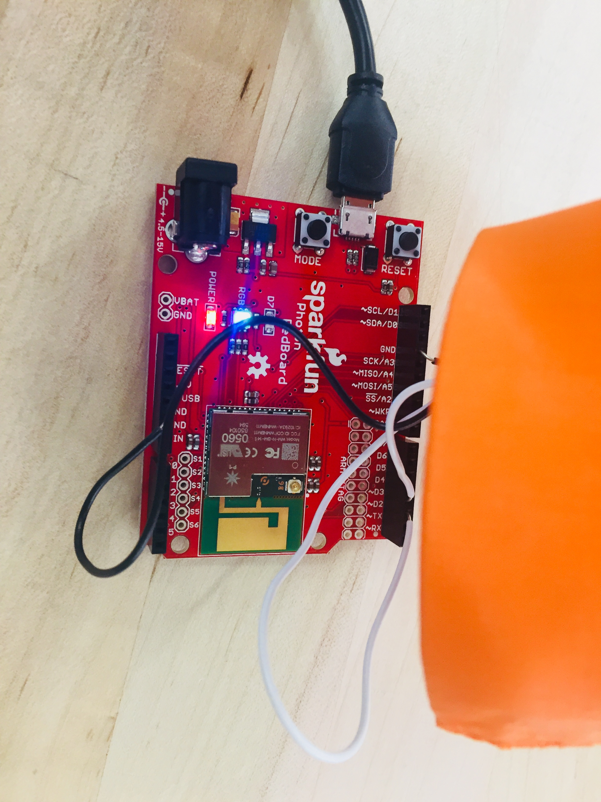
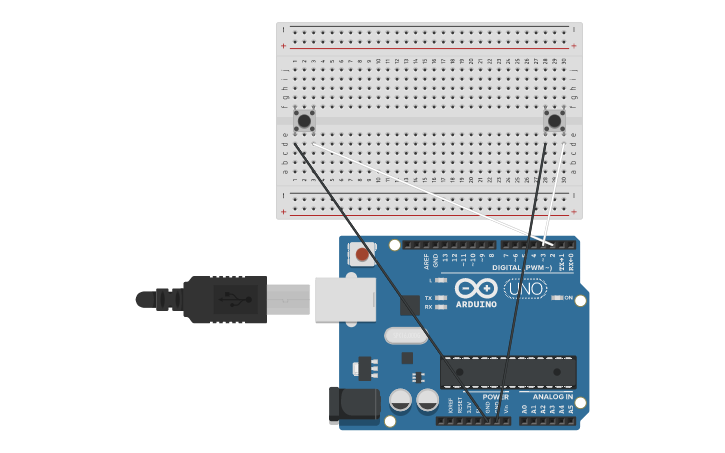

# Midterm IoT Project

Name:  Jo Kwon

Date:  October 11, 2017

## Project: "Healthy Pikachu"

### Conceptual Description

Children are not easily motivated into learning new concepts. Therefore, scholars and companies strive to solve this problem by introducing new products or ideas. As Natalie Jeremijenko states in her interview with Garnet Hertz, she thinks that creating stuff is the fundamental of intellectual activity. Children can engage in this intellectual activity when they are making something. Jeremijenko strongly argues that simply assembling Lego for robotics without the knowledge of the right material and function is useless. It is vital for people to understnd the fundamentals in these activities. In order for people to know the fundamentals, open source is also necessary. Therefore, people, especially children, should be able to engage in the making process with instructions of the whole process of the "Healthy Pikachu." It will enable children to learn. The children will not be able to code and only engage in assembling but each step will have explanations for fundamentals to be overviewed. "Healthy Pikachu" allows children to engage in critical making. 

In the early 2000s, children would play with their tamagotchi which was a small digital pet. The pet would eat, sleep, and feel emotions. If it did not get feed properly, the emotion of the pet would change to an upsetting mode. Some children played with the tamagotchi instead of real pets. Although the digital pet was not "real," children would learn responsibilities for taking care of other living things. Recently, Pokemon Go, location-based augmented reality game, was popular and it motivated many people to chase after pokemons. People were traveling to other cities to catch the unique pokemons that did not exist in their city. There were many advantages of the introduction of the Pokemon Go to the society and one of them was exercising by walking around areas to catch pokemons. The Kolibree toothbrush was an example that I talked about before which made children to brush their teeth with interactive games on smart phones. Pokemon Go and the Kolibree toothbrush are examples that show people can make healthy choices with the help of technology. "Healthy Pikachu" will enable children to eat more healthier with the motivation of making Pikachu in a happy state. 


///
### Form

As I stated in the previous section about tamagotchi and Pokemon Go, I wanted to use a physical form that was appealing to children. Pikachu is a fictional character but many people adore it in various forms including stuffed animals, games, and cartoons. Pikachu in a 3D is more real than in a 2D form. When buttons are pushed, there are different reactions from the Pikachu. The first case: green button is pressed and Pikachu is "happy" and the second case: red button is pressed and Pikachu is "sad." People who trigger the buttons reward themself if they ate healthy and punish themselves if they ate unhealthy. This process is motivational to people to have better choices in their eating habits. "Healthy Pikachu" is promoting healthy habits for people. I am planning to add more buttons for other healthy choices such as sleep or exercise. In addition, more information about healthy choices will be sent through email to people who press the button.

**Finished Enclosure:**



**Electronics Exposed:**




### Technical Details
Here you should give an overview of the technical operation of your device, including:
1. The hardware that I used are the followings:
Sparkfun
two buttons
four wires
3D printing Pikachu model

2. Wiring Diagram



3. Explanation and Code

When green button(buttonPin1) is pressed, Pikachu sends an email to you stating "Pikachu is HAPPY because you are healthy!"
When red button(buttonPin2) is pressed, Pikachu sends an email to you stating "Pikachu is SAD because you are eating junk food."
When green button(buttonPin1) and red button(buttonPin2) is pressed together at the sametime, Pikachu sends an email to you stating "Pikachu is eating too much!"
You can include code snippets here:

```
Particle.subscribe("Execute", messageParse, MY_DEVICES);
```

*link to the project's full code in this repository:  [photon.ino](photon.ino)


